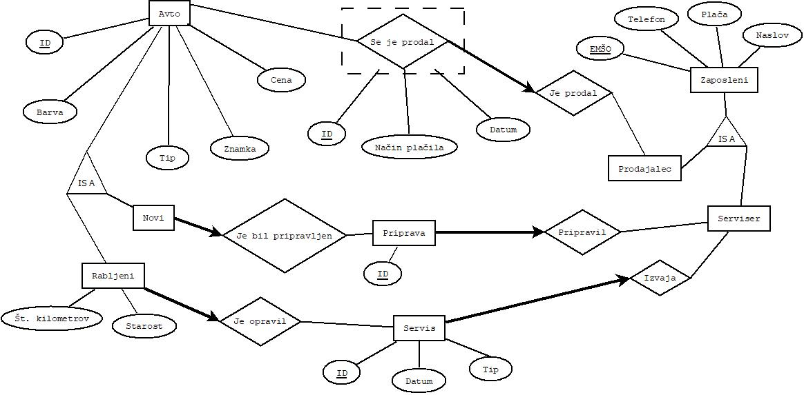

# Avtohisa
Projekt pri OPB

## ER diagram

## Opis ER diagrama
 * Imamo tabelo Avto, v kateri beležimo ID, ki je številka šasije, barvo, tip avta, znamko, ter njegovo ceno.
 * Imamo dve vrsti avtov, nove in rabljene, za katere imamo še podatke o številu kilometrov ter starosti. 
 * Vsak novi avto mora biti pripravljen za prodajo, zato beležimo nek ID oz. številko priprave, katero izvede serviser, ki pa sestavlja ekipo zaposlenih, za katere beležimo EMŠO, njihov telefon, naslov ter plačo.
 * Vsak rabljeni avto, pa mora pred začetkom prodaje opraviti servis, katerega prav tako izvede serviser. Za tak servis beležimo številko servisa, datum, ter za kakšen tip servisa je šlo (pregled, popravilo manjših napak, večji popravki).
 * Ker pa avte tudi prodajamo, v tabeli Prodaja, beležimo številko računa, način plačila, ter datum kdaj je bil avto prodan. Vsako prodajo izvede en prodajalec, kateri tudi sestavlja ekipo zaposlenih.

## Opis aplikacije
V aplikaciji bodo vsi uporabniki imeli možnost, da si ogledajo katere avte lahko kupijo ter njihove lastnosti. Iskali bodo lahko po različnih parametrih, na primer po ceni, tipu vozila, barvi, starosti in podobno.
Zaposleni v podjetju, pa bodo imeli možnost nakupa oziroma dodajanja novega avta v bazo, vnašali bodo lahko podatke o opravljenem servisu in pregledu. Avto bodo "prodali" torej odstranili iz baze.
