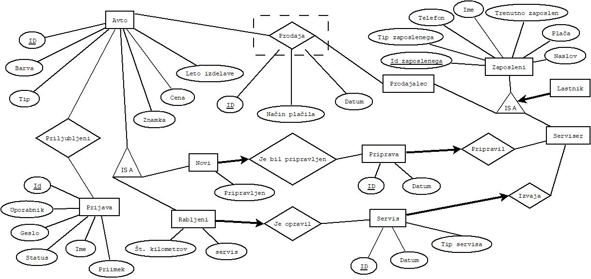

# Avtohisa
Projekt pri OPB
*  Aplikacija `bottle.py`

## ER diagram

## Opis ER diagrama
* Glavna tabela je tabela *avto*, v kateri beležimo:
    * id (ki je številka šasije),
    * barva,
    * tip_avta,
    * znamka,
    * cena,
    * leto_izdelave in
    * nov (ali je avto nov ali ne).
 * V tabeli *novi* imamo podatka:
    * id_avto,
    * pripravljen (default vrednost = false).
* V tabeli *rabljeni* imamo dodatne podatke za rabljene avtomobile:
    * id_avto,
    * st_kilometrov,
    * servis (datum zadnjega servisa).
 * V tabeli *priprava* hranimo podatke o pripravi novega avtomobila.
    *  id,
    *  id_avto,
    *  datum,
    *  id_zaposlenega.
 * V tabeli *servis* pa hranimo podatke o servisu avtov, ki so bili narejeni v naši avtohiši.
    * id,
    * id_avto,
    * datum,
    * tip_servisa (mali, večji ali velik),
    * id_zaposlenega.
* V tabeli *prodaja*, hranimo vse avte, ki smo jih do sedaj prodali.
    * id,
    * id_avto,
    * datum,
    * nacin_placila,
    * id_zaposlenega.
 * V tabeli *zaposleni* imamo podatke:
    * id_zaposlenega (emšo),
    * tip_zaposlenega (prodajalec ali serviser, lastnik je samo eden),
    * ime,
    * telefon,
    * placa,
    * naslov
    * trenutno_zaposlen.
* V tabeli *priljubljeni* imamo podatke:
    * id,
    * uporabnik,
    * id_avto.
* V tabeli *prijava* imamo podatke:
    * uporabnik,
    * geslo,
    * status,
    * ime,
    * priimek.

## Opis aplikacije
V aplikaciji bodo vsi uporabniki imeli možnost, da si ogledajo katere avte lahko kupijo ter njihove lastnosti. Iskali bodo lahko po različnih parametrih, tipu vozila, barvi, starosti in podobno. Če se uporabnik registrira, dobi še možnost, da avte dodaja med svoje prljubljene.

Zaposleni v podjetju, bodo lahko avtom dodali servis ali pripravo, avto pa bodo lahko tudi prodali. Imajo tudi vpogled v vse narejene servise in priprave ter v bazo prodanih avtomobilov.

Lastnik podjetja bo imel največ pravic. Poleg vseh možnosti, ki jih imajo navadni zaposleni bo lahko še kupil avto, imel pregled nad zaposlenimi in zaposlil novega delovca.
